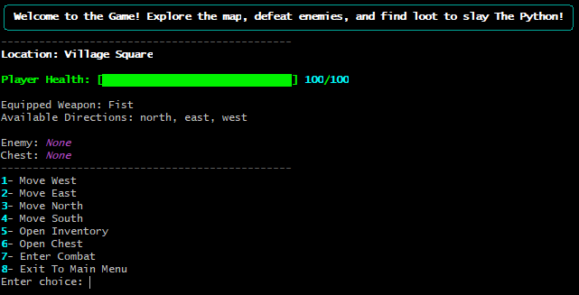
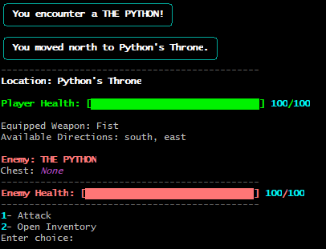
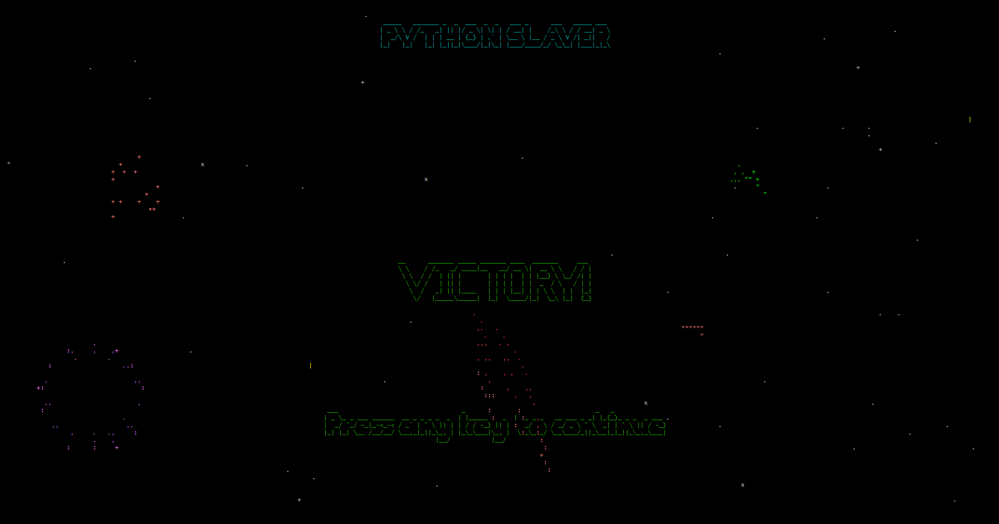

# Python Slayer

## Project Summary

Python Slayer is a command-line RPG built in Python. The player explores a grid-based world, collects loot, manages inventory, fights enemies, and wins by defeating `THE PYTHON`.

## Features

### Core Gameplay

- Move around a 2D grid map (north, south, east, west)
- Fight enemies in turn-based combat
- Find weapons and potions in chests or dropped from defeated enemies
- Swap weapons and use potions in your inventory anytime
- Enemies get tougher the farther you get from spawn

### Customization

- Pick from 3 maps (easy, default, hard)
- Pick from 2 loot tables (default, overpowered)
- Edit or add JSON files to create custom maps and items

### UI & Visuals

- Color-coded terminal interface using Rich library
- ASCII animations when you win or lose
- Live HUD showing health, weapon, location, enemies, and chests
- Access inventory during combat

### Goal

- Slay `THE PYTHON` to win and save the village

## User Stories

A Player should be able to,

- Explore the map to find enemies, chests, and reach the final boss
- Battle enemies strategically to survive
- Collect better weapons and healing potions
- Use inventory mid-combat to heal or swap weapons
- Face tougher enemies as you move away from spawn
- Choose different maps and loot tables for variety
- Track game state easily with the HUD
- Beat THE PYTHON to win the game

## Project Structure

- `play_game.py`: entry point
- `core/`: entity (player, enemy), loot (weapon, potion)
- `systems/`: menus, game loop, combat, UI, game state
- `world/`: map/chest/location logic + JSON data files

## Quick Start

### Requirements

- Python (3.11 recommended)
- `rich`
- `asciimatics`

Run from the project root (`UNIT-PROJECT-1`):

Install dependencies:

### Windows

```
python -m venv gameEnv
source gameEnv\Scripts\activate
pip install -r requirements.txt
python play_game.py
```

### macOS/Linux

```
python3 -m venv gameEnv
source gameEnv/bin/activate
pip3 install asciimatics rich
python3 play_game.py
```

##### \*\*\* if you are havinng issues installing dependencies I only used `rich` and `asciimatics`

## Controls

#### For the best gameplay experience, run the CLI in full-screen mode.

Main Menu:

1. Start Game
2. Exit

Start Menu:

1. Start New Game
2. Change Map
3. Change Loot Drops
4. Back to Main Menu

In Game:

1. Move West
2. Move East
3. Move North
4. Move South
5. Open Inventory
6. Open Chest
7. Enter Combat
8. Exit To Main Menu

Combat:

1. Attack
2. Open Inventory

Inventory:

1. Change Weapon
2. Use Potion
3. Close Inventory

## Custom Content

Content files are loaded from:

- Maps: `world/maps/`
- Loot: `world/loot_drops/`

Included examples:

- Maps: `default_map.json`, `easy_map.json`, `hard_map.json`
- Loot Drops: `default_loot.json`, `overpowered_loot.json`

Maps File format:
Must include `THE PYTHON` by having `Python's Throne` as a location in the map, like this:

```json
{ "name": "Python's Throne", "enemy": true, "chest": false },
```

Other locations:

```json
{ "name": "Village Square", "enemy": false, "chest": false }
```

Notes:

- Map JSON must be a 2D list (list of rows).
- Each cell must include: `name`, `enemy`, `chest`.
- Keep all rows the same width (rectangular grid).
- Include exactly one throne location named `Python's Throne` for the final boss.

Loot Drops File format:
Weapons:

```json
{ "type": "Weapon", "name": "Sword", "damage": 10, "level": 1 }
```

Potions:

```json
{ "type": "Potion", "name": "Health Potion", "health_restore": 20, "level": 1 }
```

## Gameplay Example

### Player HUD:



### Combat:



### Victory Screen:



### Map Grid Visualization: (easy map)


